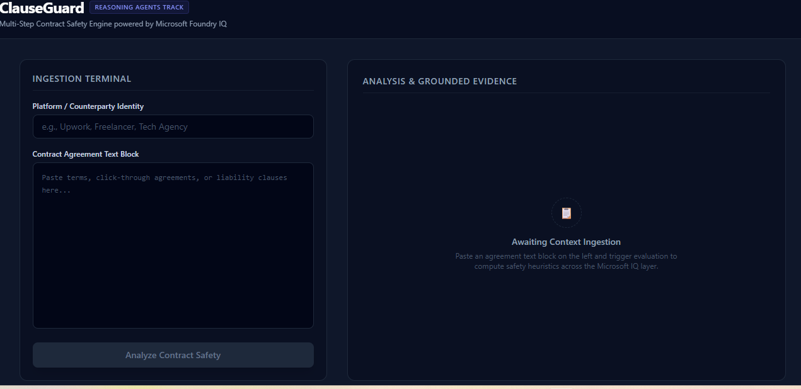
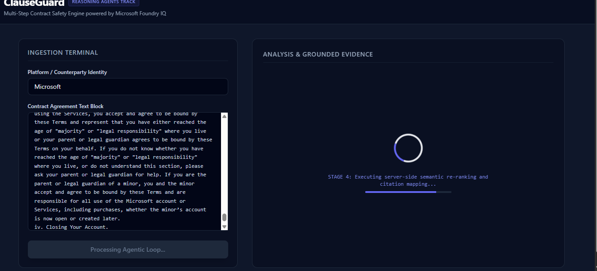
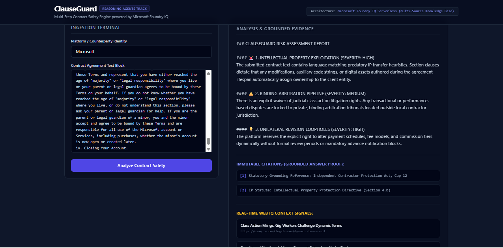

# ClauseGuard 🛡️  
### Independent Contractor Legal Safety Workspace  
*Submission for the Microsoft Agents League Hackathon @ AI Skills Fest 2026 — Creative Apps Track*

ClauseGuard is an AI-assisted creative productivity application designed to protect independent freelance developers, gig workers, and remote creators. It transforms dense, jargon-heavy legal contracts into clear, scannable safety diagnostics backed by grounded statutory citations and live web risk signals.

---

## 🎯 The Core Problem Solved

In the modern digital economy, freelancers routinely agree to click-through platform contracts and rapidly changing Terms of Service documents. These agreements often conceal predatory clauses—such as excessive intellectual property transfers, unilateral fee revisions, or foreign arbitration mandates—inside dense legal text.

Hiring legal counsel for every contract is financially unrealistic for most independent creators. **ClauseGuard** bridges this gap by converting opaque legal language into an accessible, explainable safety audit that helps creators make informed decisions before signing.

---

## 🧩 Challenge Alignment — Creative Apps Track

ClauseGuard qualifies as a **Creative App** by transforming traditionally inaccessible legal content into an interactive, human-readable safety workspace.

**Creative App characteristics demonstrated:**
- Converts complex legal prose into structured, scannable safety insights
- Visualizes multi-step agentic reasoning during analysis
- Enhances creator decision-making rather than replacing human judgment
- Embeds AI directly into a real-world productivity workflow

The application prioritizes clarity, accessibility, and creative empowerment—core objectives of the Creative Apps challenge.

---

## 📊 Application Interface Workspace

### 1. Ingestion Viewport (Empty State)
A minimalist dark-mode interface designed to reduce cognitive overhead during contract ingestion.  


### 2. Multi-Step Agentic Reasoning Loop
During evaluation, the UI visualizes the agent’s reasoning phases, keeping users informed as the contract is decomposed and analyzed.  


### 3. Grounded Analysis Matrix (Audit Complete)
The final audit presents clause-level severity indicators, statutory citations, and live web risk signals.  


---

## 🏗️ Technical Architecture & Multi-Source IQ Flow

ClauseGuard coordinates an advanced, parallel context-retrieval pipeline built to showcase the capabilities of the **Microsoft IQ** intelligence layer.

```text
┌───────────────────────────────────────────────┐
│           Freelancer Workspace UI              │
│             (React / Tailwind)                 │
│                                               │
│  • User pastes contract / ToS text             │
└───────────────────────────┬───────────────────┘
                            │
                            │  Unstructured Contract Text
                            ▼
┌───────────────────────────────────────────────┐
│           Node.js Express API Server            │
│                                               │
│  • Request validation & sanitization           │
│  • Orchestrates parallel agent calls           │
│  • Normalizes and aggregates results           │
└───────────────────────────┬───────────────────┘
                            │
            ┌───────────────┴────────────────┐
            │        Parallel Intelligence     │
            │             Execution            │
            │                                  │
            ▼                                  ▼
┌───────────────────────────────┐   ┌───────────────────────────────┐
│          Foundry IQ            │   │        Foundry IQ: Web IQ      │
│   Serverless Knowledge Agent   │   │     Live Intelligence Agent    │
│                               │   │                               │
│  • Statutory labor laws        │   │  • Active lawsuits             │
│  • Freelancer protection acts │   │  • Regulatory changes           │
│  • Grounded legal citations   │   │  • Emerging ToS disputes        │
└─────────────────────┬─────────┘   └─────────────────────┬─────────┘
                      │                                   │
                      └───────────────┬───────────────────┘
                                      │
                                      ▼
┌───────────────────────────────────────────────┐
│             Unified Safety Audit UI            │
│                                               │
│  • Clause-level red flags                      │
│  • Statutory & web citations                   │
│  • Explainable safety insights                 │
└───────────────────────────────────────────────┘
> **Design Note:** Foundry IQ and Web IQ execute in parallel to minimize latency while combining grounded statutory compliance with real-time legal risk detection.

---

## 🔗 Integrated Systems Strategy

**Microsoft Foundry IQ Core Integration**  
Unstructured contract text is mapped directly to the unified `/knowledgebases/{id}/query` pattern, enabling analysis against indexed labor laws and freelance protection statutes. This grounding strategy ensures citation-backed outputs and minimizes hallucination risk.

**Microsoft Web IQ MCP Source Integration**  
Parallel Web IQ retrieval surfaces live legal signals such as class-action lawsuits, regulatory shifts, and emerging contractual disputes relevant to the analyzed clauses.

---

## 🤖 AI-Assisted Development (GitHub Copilot)

ClauseGuard was developed using **GitHub Copilot** tools within **VS Code**, satisfying the AI-assisted development requirement of the hackathon.

Copilot was used to:
- Plan and refine asynchronous orchestration flows in the Node.js backend
- Accelerate React component scaffolding and state management patterns
- Assist with client-side text sanitization utilities
- Prototype CLI workflows through Copilot-assisted terminal interactions

All Copilot-generated suggestions were reviewed, adapted, and validated by the developer to ensure correctness, security, and maintainability.

---

## 🔐 Reliability, Safety & Responsible AI

ClauseGuard was designed with safety-first principles:

- No contract data is persisted beyond active analysis
- Client-side sanitization removes emails and phone numbers before submission
- All statutory findings are citation-backed
- Outputs are framed as risk indicators, not legal advice

### Known Limitations
- Jurisdictional accuracy depends on indexed statutory sources
- Web IQ signal coverage may vary by region
- ClauseGuard does not replace professional legal counsel

---

## 📁 Repository Structure

```text
clauseguard-AI/
├── backend/          # Node.js Express orchestration server & PII security gate
├── frontend/         # Vite + React dashboard workspace UI & Tailwind tokens
├── .env              # Local environment runtime configuration constants (git-ignored)
├── .gitignore        # Explicit exclusion matrix targeting node_modules and secrets
├── LICENSE           # Official open-source MIT legal compliance documentation
├── package.json      # Workspace root dependencies orchestration configuration
└── README.md         # Comprehensive systems architectural documentation and guide
---

## 🎥 Demo Video

A 5-minute walkthrough demonstrating:
- Contract ingestion
- Live multi-step agent reasoning
- Statutory citation grounding
- Web IQ risk detection
- Final safety audit output

📺 **Demo Video:** *(Link to be added before final submission)*

---

## ⚙️ Local Workspace Verification

### 1. Clone Repository
```bash
git clone https://github.com/Nickfx9/clauseguard-AI.git
cd clauseguard-AI
2. Environment Setup

Create a .env file in the root directory:

PORT=5000
FOUNDRY_IQ_ENDPOINT=https://api.foundry.microsoft.com/v1
FOUNDRY_IQ_KB_ID=clauseguard-statutory-laws-2026
FOUNDRY_IQ_API_KEY=mock_key_during_initial_local_dev
3. Run Services
npm install
npm run dev
